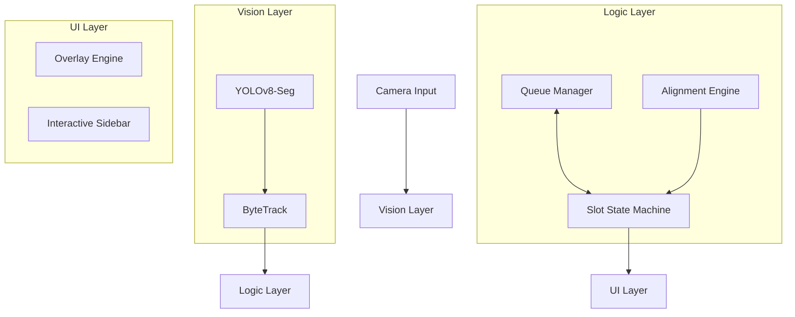
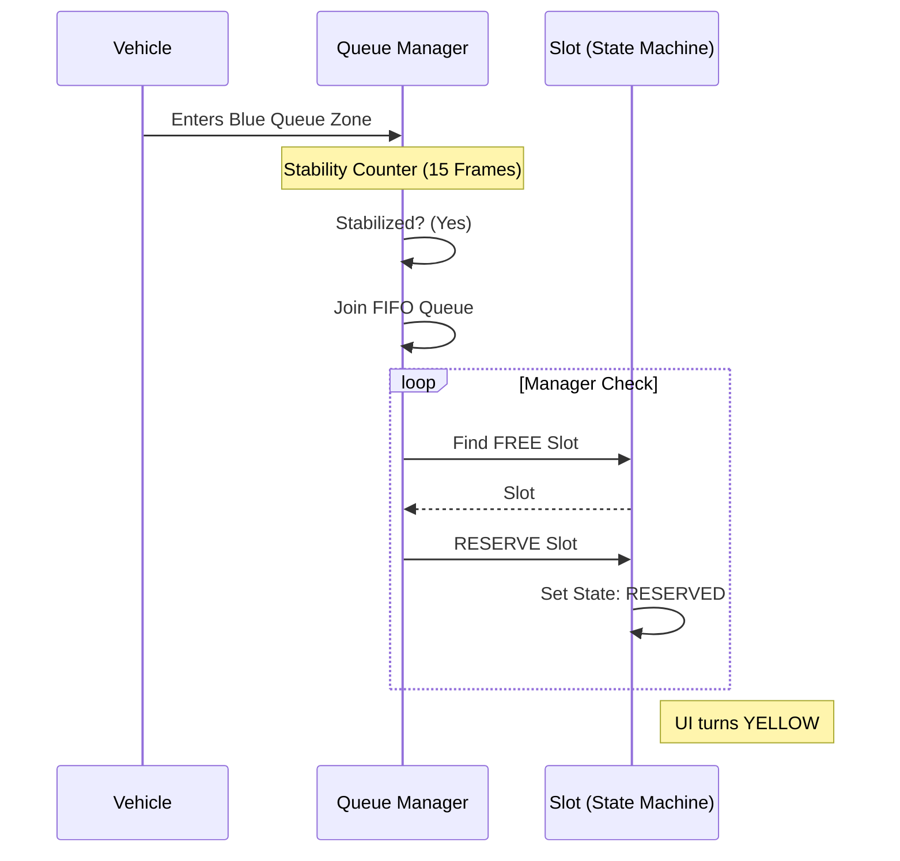
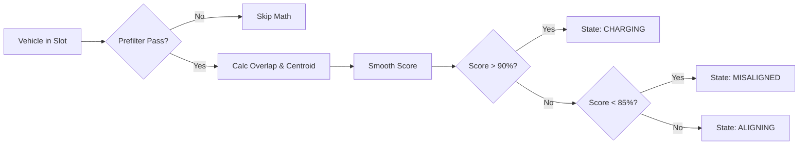
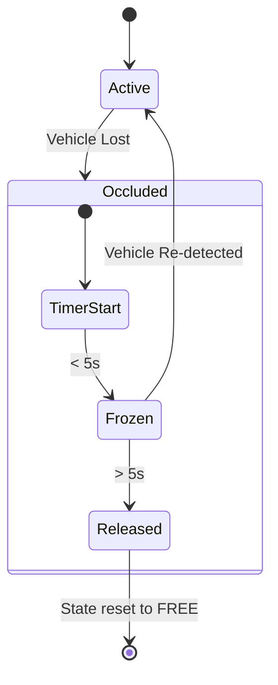

# Technical Specification: Smart EV Charging System (v1.1)

This document provides a comprehensive technical breakdown of the Smart EV Charging Detection System, covering architectural layers, algorithmic logic, and functional workflows.

---

## 🏗️ 1. System Architecture

The system follows a **Modular Layered Architecture** to separate vision processing, business logic, and UI display.

---

## 🛠️ 2. Detailed Feature Descriptions

### [F1] Precision Segmentation & Tracking
- **Internal Logic**: The `SlotDetector` (`detector.py`) extracts binary masks for `class_ids` (cars, trucks, motorcycles). Unlike bounding boxes, these masks represent the actual footprint of the car.
- **Persistence**: `ByteTrack` (`tracker.py`) assigns a persistent ID to each vehicle. This ID is used by the `Slot` class to "lock" onto a car during alignment.

### [F2] Hybrid Alignment Algorithm
The `AlignmentEngine` (`alignment_engine.py`) determines parking quality using two primary metrics:

1.  **Mask Overlap ($R_{overlap}$)**:
    $$R_{overlap} = \frac{Area(Mask \cap Slot)}{Area(Mask)}$$
    *   **Logic**: High overlap ensures the car is actually "inside" the spot.
2.  **Centroid Alignment ($R_{centroid}$)**:
    $$R_{centroid} = 1.0 - \min(1.0, \frac{Distance(C_{mask}, C_{slot})}{Threshold})$$
    *   **Logic**: Ensures the car is centered, not just overlapping the edges.
3.  **Temporal Smoothing**:
    $$Score_{t} = (0.7 \times Score_{t-1}) + (0.3 \times RawScore_{t})$$
    *   **Logic**: Prevents rapid "flickering" of UI colors due to noise.

### [F3] Slot State Machine
Each `Slot` object manages its own lifecycle independently:

| State | Color | Trigger |
| :--- | :--- | :--- |
| **FREE** | Green | No vehicle assigned or detected. |
| **RESERVED** | Yellow | Vehicle from queue assigned, awaiting arrival. |
| **ALIGNING** | Orange | Vehicle detected; validating position. |
| **CHARGING** | Green (Over) | Score > 90%; Power authorized. |
| **MISALIGNED** | Red (Blink) | Score < 85%; Visual alert for sloppy parking. |

---

## 🔄 3. Functional Workflows

### [W1] Vehicle Intake & FIFO Reservation
This workflow describes how a vehicle enters the system and secures a spot.

### [W2] Alignment & Power Authorization
This workflow covers the transition from arrival to active charging.

### [W3] Occlusion & Safety Watchdog
How the system handles vision loss (e.g., someone walks in front of the lens).

---

## ⚙️ 4. Technical Configuration (`config.yaml`)

| Key | Type | Description |
| :--- | :--- | :--- |
| `slots` | List[Points] | Boundary polygons for charging spots. |
| `queue_zones` | List[Points] | Boundary polygons for approach queue. |
| `conf_threshold`| Float | Detection sensitivity (Default: 0.15). |
| `class_ids` | List[Int] | COCO IDs for vehicles (2,3,5,7). |

---
**End of Specification**
